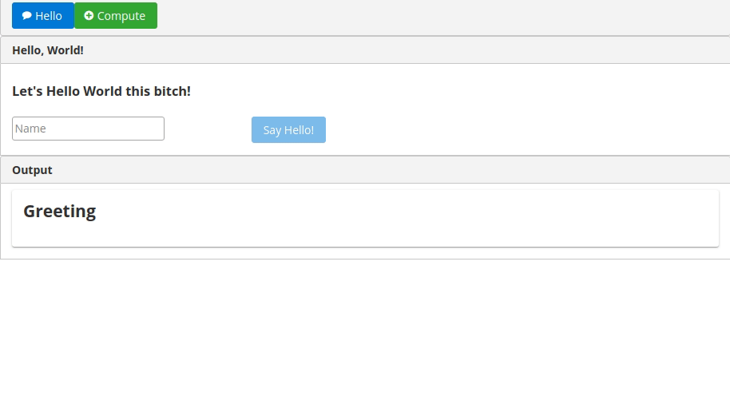
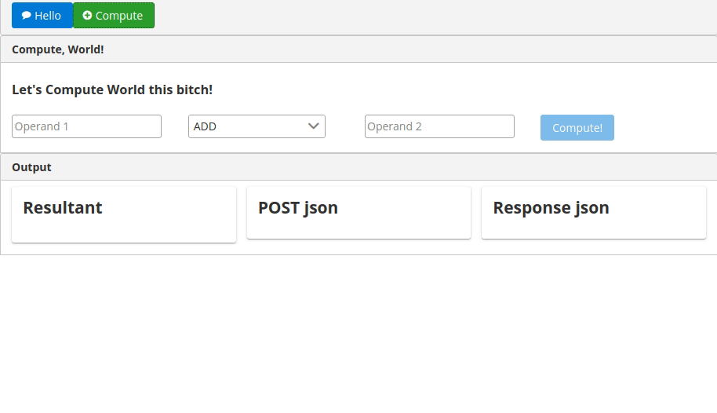

# The App

### Hello, World!


### Compute, World!


# Required software

* Netbeans 11.1 or greater
* Java JDK 8
* Payara Server 5.193.1 or greater
* Node.js 13+
* git

Make sure that the `node/bin` and `git`/`gitbash` paths are on your system/user execution path.  If you're on window, use `gitbash` (installed with git) instead of `powershell` for your command line.

# Getting this repo

## Clone 

```shell
$ git clone https://github.com/johnmanko/jaxrs-ng.git
$ cd jaxrs-ng/jaxrs-ng
```
# Configuring the Angular application

## Node modules to install globally

```shell
$ npm i -g gulp-cli
$ npm i -g @angular/cli
```

## Install project npm modules
```shell
$ npm install
```

## Launch Angular's test server
```shell
$ gulp ngServe
```

# Netbeans

Open the project in Netbeans and make sure you have Payara added as a server

Right click on the root project and folder and `Clean and Build`.  When complete, open the `jaxrs-ng-web` module and right click to `Run`.

# Running the application

Open http://localhost:4200 in your favorite browser.
